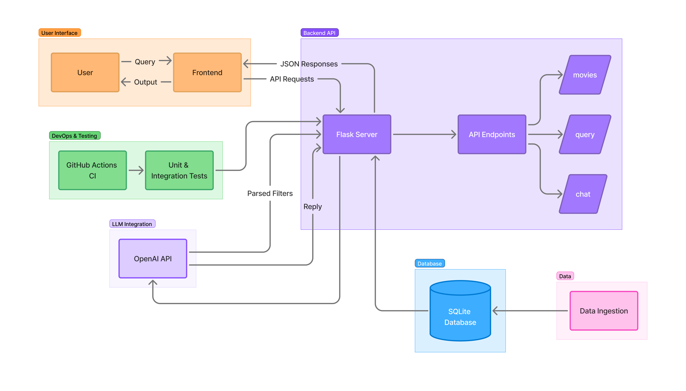

# # Movie Chat


**Movie Chat** is a simple conversational movie assistant built with **Flask**, **Streamlit**, and **OpenAI GPT**.  
It allows users to explore and discover movies by asking natural language questions instead of using filters or forms.

---

## Overview

Movie Chat lets you search and talk about movies conversationally.  
For example, you can ask:

> “Show me top-rated action movies after 2015.”  
> “Who directed The Matrix?”  
> “Recommend some action movies.”

The backend (Flask) manages the movie data and connects to OpenAI for understanding your query and generating a response.  
The frontend (Streamlit) provides a simple chat interface that remembers your conversation.  

This project demonstrates how large language models can be integrated with structured databases to provide smart, contextual, and human-like interactions.  
It is lightweight, modular, and designed for quick experimentation or educational use.


---

## Architecture

Below is the high-level architecture diagram showing how all components interact.




**Main Components**
- **Streamlit Frontend** — Chat interface where users type queries  
- **Flask API** — Handles movie search, natural language parsing, and conversation logic  
- **OpenAI API** — Converts user queries into structured filters and generates conversational answers  
- **SQLite Database** — Stores movies, genres, and cast/director information  
- **GitHub Actions + Pytest** — For automated testing and CI integration

---
## Tech Stack

- **Frontend:** Streamlit  
- **Backend:** Flask + SQLAlchemy  
- **AI Models:** OpenAI GPT-4o-mini  
- **Database:** SQLite  
- **Testing:** Pytest  
- **CI/CD:** GitHub Actions  

## Setup Instructions

### 1. Clone the Repository
```bash
git clone https://github.com/<your-username>/movie_chat.git
cd movie_chat
```

### 2. Create a Virtual Environment
```bash
python -m venv venv
source venv/bin/activate  # (Windows: venv\Scripts\activate)
```

### 3. Install Dependencies
```bash
pip install -r requirements.txt
```

### 4. Set Environment Variables  
Create a `.env` file in the root folder:
```
OPENAI_API_KEY=your_openai_api_key
OPENAI_MODEL_PARSE=gpt-4o-mini
OPENAI_MODEL_REPLY=gpt-4o-mini
API_URL=http://127.0.0.1:5000
```

### 5. Build the Database
```bash
python data_db.py
```

### 6. Run the Backend
```bash
python app.py
```

### 7. Run the Frontend
```bash
streamlit run frontend.py
```

Once both are running, open the Streamlit link shown in the terminal (usually http://localhost:8501).

---

## API Endpoints

| Endpoint | Method | Description |
|-----------|---------|-------------|
| `/` | GET | Health check and list of all endpoints |
| `/movies` | GET | Get movies (filter by genre, year, or rating) |
| `/movies/<id>` | GET | Get detailed movie info |
| `/movies/search?title=` | GET | Search by movie title |
| `/movies/random` | GET | Get a random movie |
| `/people?name=&role=` | GET | List people by name or role |
| `/actors/<name>` | GET | Movies featuring an actor |
| `/directors/<name>` | GET | Movies directed by a director |
| `/genres` | GET | List all genres |
| `/top-rated?genre=&limit=` | GET | Top-rated movies |
| `/query` | POST | Parse a natural-language query |
| `/chat` | POST | Chat endpoint that keeps conversation context |

---

## Run Tests

To verify the API and chat features:

```bash
pytest -v
```

---


## Demo
